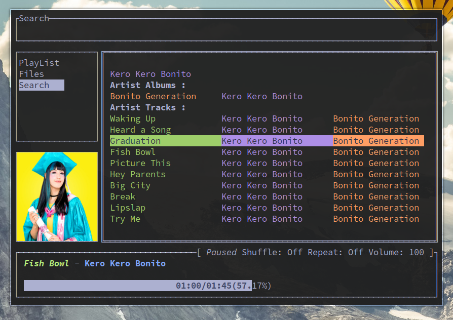

# gomp

<div class="info" align="center">
    <br><br>
    MPD client inspired by ncmpcpp <br>
    with builtin <b>cover-art view</b> and <b>LastFM integration.</b> <br>
    <a href="https://aditya-K2.github.io/gomp/"> Documentation </a> |
    <a href="https://github.com/aditya-K2/gomp/discussions">Discussion</a>
</div>

----



# Features

- **Live Config Changes**
- **Cover Art View**
- **LastFM Integration** *(Cover Art)*
- **Fuzzy Searching** *(Global and Buffer Specific)*

# Roadmap

- [ ] Vim-like Visual Mode

### Things to Note:

- Images are rendered using the X child windows. Currently there is ***no support*** for Wayland.

***See Docs for information on how to Hide Images***

# Installing / Building

### AUR Package [](https://aur.archlinux.org/packages/gomp-git/)

```bash
yay -S gomp-git
```

###### Pre-built Binaries are available [here](https://github.com/aditya-K2/gomp/releases/tag/pre-release)

## Manually

- Install `go` and `git` through your package manager and then

```bash
$ git clone https://github.com/aditya-K2/gomp
$ cd gomp
$ sudo make install
```
---
